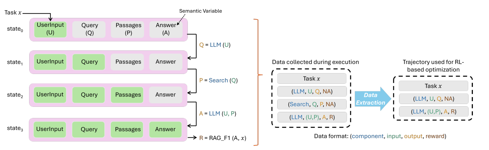

# Agent Lightning — 用状态对象连接执行与训练

**核验：Verified。** 2025 arXiv v1，未把它标为已录用顶会论文。来源：[原始论文](https://arxiv.org/abs/2508.03680)；[PDF](../01_papers/agent_lightning.pdf)。检查 Fig.1 / PDF p2、Fig.2 / p6、Fig.3 / p8、Fig.4 / p9，并读 §3.1–3.4。主分析为 Fig.2，Fig.1、3、4提供训练层的对照。

## A. 第一眼的科学命题

Fig.2 最显眼的是左侧四行**同槽位状态**：UserInput、Query、Passages、Answer 保持相同位置，绿色槽位逐次增多。读者不需要先读算法名，便可看出执行改变状态；右侧进一步说明哪些调用进入 RL 数据。这比把 State、Execute、Collect、Train 各画成一个盒子更有解释力。Fig.1 的双向大弧线则以极少对象表达“轨迹送训练、更新模型回执行”。

## B. 全局组织

Fig.2 左约一半是四个时间快照，右侧是两个对齐的记录集合。一个竖向括号把整个状态序列映射为调用记录，再由单个宽箭头做数据提取。它不是单一水平流水线：左侧时间向下，跨区域的表征转换向右，两个方向承担不同语义。Fig.4 把训练与运行放在两侧，中间只有模型接口/奖励轨迹交叉传输；其科学主张就是解耦，因此工程架构形式在这里有明确理由。

## C. 局部机制如何展开

每对状态之间只标一条操作式，例如 LLM 或 Search 使用哪些变量。输入、输出、组件在右侧元组中延续同色，成为跨区域的对象对应。没有另造一个“数据处理模块”去解释这些关系。Fig.3 采用对照式小多图：左侧两种已有 GRPO，右侧展开自己的 transition 分组。它解释算法差异而不是增加一堆模块。

## D. 图与状态

状态是固定字段的快照；有效/尚未赋值通过颜色切换表示。右侧元组删掉 Search 调用，对应只抽取 LLM 决策训练的数据规则，已与 §3.2.2 核对。这里没有恢复图、历史分支或 checkpoint 祖先边。不能把四个 state 行当成 GitHarness 的历史版本，也不能把“灰色尚未赋值”直接当成 stale/excluded。

## E. 训练

Fig.1 训练约占右三分之一，Fig.2 约占右半边，Fig.3 全部研究优化数据的组织，Fig.4则是训练/执行系统界面。论文没有强迫一张图包办所有层级。§3.2.2明确讨论选择特定 agent 的 transition 进行优化；GitHarness可以借“哪些决策被抽取”的表达，但不能因它支持多模型就给 Router 或 Update Agent 画训练箭头。图中灰色 token mask 也不是“冻结模块”标志。

## F. 密度

高效信息来自对齐槽位、重复布局、括号和有意义的同色文字。Fig.2 的完整四行状态虽然重复，但每一行都有状态差分；属于有用冗余。Fig.1中的机器人、数据库和品牌图标不是可迁移重点，GitHarness不需要这些资产。

## G. 纸面尺度

实际检查约680px宽缩略图，模拟180mm@96dpi的桌面预览。Fig.2的状态列和两个数据集合仍可辨，右侧元组及箭头标签需仔细看；Fig.3的 token 小块与下标更拥挤。这个检查不是印刷实验，也不保证所有显示器的物理尺寸一致。建议只迁移固定槽位到 W4→W_t^0→W̃_t 的三状态比较，不迁移完整 training-transition 表。

## H. GitHarness迁移

**迁移：** W4与候选状态共享四个行槽；仅 Evaluation 改色、Legacy API留空/删除标记，Core Logic/Utilities保持位置。这个局部应从版本图中的 v4 和候选节点“放大出来”，而不是成为独立流程图。训练用一条奖励数据去向与一条参数返回线，返回唯一 Git Agent。

**不迁移：** 多agent平台图标、server/client架构、无序有效槽位填充、详细token分组。GitHarness核心是 requirement-compatible base selection，不是通用RL服务。最终框架不应让训练引擎占据与版本图相同的视觉权重。

**评价：技术相关性4/5；视觉借鉴价值4/5（Fig.2），整套复制价值低。**
