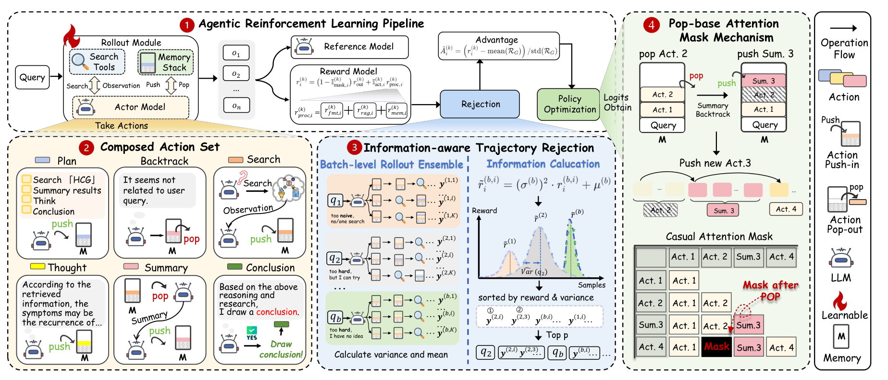

# AgenticRag-R1 — 一条主流程与三个机制放大

**核验：Verified。** arXiv:2608.29622v1，2026年8月预印本；未核实会议录用，不能写成 ICLR/NeurIPS。这里核验的是检索到的原论文 Fig.2 / PDF p4，并不能证明它就是用户此前提供的特定参考图片。来源：[论文](https://arxiv.org/abs/2608.29622)；[本地PDF](../01_papers/agenticrag_r1.pdf)。对照图注及 §2、§2.1、§2.2（PDF p3–5）。

## A. 第一眼的科学命题

第一眼看到顶部长条 RL 主线，接着看到下方黄色动作区、蓝色轨迹筛选区、右侧绿色记忆机制区。它不是简单声称“Agent有Memory”：右侧 push/pop、被划掉的动作、attention矩阵揭示**记忆操作如何改变后续可见性**。图的辨识度来自可操作的科学对象——栈、动作序列、轨迹集合——而不只是机器人图标。

## B. 全局组织

四个主要编号区域加一个窄图例：①上方主流程约占主体上四分之一；②左下动作集合；③中下轨迹筛选；④右侧贯穿高度的记忆机制。前三者形成紧密的拼接结构，右侧是垂直机制墙。顶层主线的 Rollout、Rejection、Policy Optimization 与下层区域之间有淡色楔形展开关系，所以细节有明确的“父对象”。不是四个平级模块随意相邻。

## C. 机制展开

黄色楔形从 Rollout 的 Take Actions 展开为六种动作；蓝色楔形从 Rejection 展开为 rollout ensemble→信息计算→排序选取；绿色楔形把主流程右端关联到 memory mask。动作色块在六动作例子、rollout轨迹和栈里重复出现，读者借色和形状跨区域匹配同一对象。GitHarness最值得学的是这种主对象到机制细节的指认关系。

## D. 图与状态

它主要是栈与序列，不是历史版本DAG。右栏把两个相邻栈快照、pop/push箭头、随后新增动作和下方可见性矩阵放在同一纵轴上。画叉/阴影的Act.2与attention中的mask单元对应，空间承担了因果说明。§2.1说明LIFO push/pop、Backtrack及Summary的pop-then-push操作，证实这些不是纯装饰。GitHarness不能把pop解释成删除历史checkpoint；候选中排除Legacy API与历史v6继续存在必须并存。

## E. 训练

本图本身就是训练框架，训练不是次要底栏。顶部有 Actor、Reference Model、Reward Model、Advantage、Rejection、Policy Optimization；火焰图例标注Learnable，Actor旁有火焰。它没有以冰雪图标逐个标冻结组件，不应从图中自行推导所有参数冻结细节。原文分层奖励、动作奖励与轨迹筛选是科学贡献，所以占较大面积；GitHarness无需照搬这种面积分配或引入信息增益拒绝机制。

## F. 密度

一部分密度确实来自机制：六动作的push/pop差异、两个query批次的轨迹、方差/均值图示、attention mask。另一部分负担来自长句气泡、多机器人、公式和重复小图标。左右列分别纵读、下方横读、多种箭头同时出现，阅读顺序成本不小。它是“局部展开有根据”的正例，也是“不能把一切都塞进主图”的警示。

## G. 纸面尺度

实际检查680px宽图。四个区域和颜色关系保留，动作短标题大致可辨，但下方示例句、方差公式、轨迹上下标很难舒适阅读。高分辨率裁图可查证细节，不等于最终通栏缩小后可读。GitHarness应只保留一个四行状态变换例子，避免再塞完整奖励公式和多条完整交互轨迹。

## H. GitHarness迁移

**迁移：** 让版本图成为主流程；从“选择v4”附近引出需求兼容性放大，从“v4→candidate”这一条边引出候选构造放大。原图中动作色跨区域复用的原则可改为Q蓝/W薄荷、更新橙、保留绿、排除灰；不复制独特手绘风、火焰或机器人资产。

**不迁移：** memory栈弹出、attention matrix、信息感知轨迹拒绝、原图训练主导比例。GitHarness不是RAG栈优化，也没有这些机制。用候选状态中的“灰色空位”解释staleness exclusion，失败则把**整个候选边界**导向discard；二者必须保持不同作用域。

**评价：技术相关性4/5；视觉借鉴价值5/5（层级展开），原图纸面细节可读性一般。**
