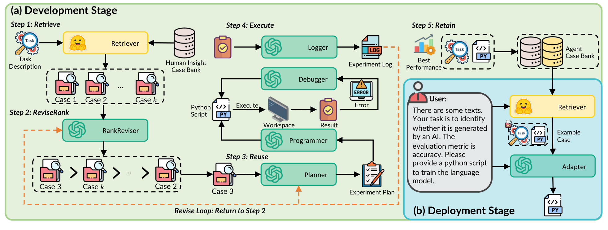

# DS-Agent — 历史案例筛选与执行反馈；有用的工程风对照

**核验：Verified。** ICML 2024，PMLR 235:16813–16848；[官方记录](https://proceedings.mlr.press/v235/guo24b.html)，[本地PDF](../01_papers/ds_agent.pdf)。主图 Fig.3 / PDF p4（印刷页4）；核对 §3、§3.1–3.2及图注（PDF p3–5）。补看Fig.2，但不把它当作主框架。

## A. 第一眼的科学命题

第一眼是绿色Development大区域内的一套检索—重排—复用—执行—保留流程，右下嵌蓝色Deployment区。其中最直接的科学对象是两行案例：第一行 Case1、Case2、…、Casek，第二行把Case3置首，再从同一个Case3进入Planner。**重排前后与被使用案例的身份连续性**比很多模块名更有价值。

## B. 全局组织

两个大区域不等大：Development占约四分之三，Deployment占右下约四分之一；共享右上Agent Case Bank。Development的流程折返穿过左下和中央再回右上，编号步骤负责组织顺序；橙虚线围绕下边缘回到RankReviser。框多但区级主题清楚。其外形仍明显是工程流程图，并不是因为发表在ICML就应全盘模仿。

## C. 机制展开

“候选集合→排序集合→单个Case3”是就地展开，没有单独Inset标签。执行阶段是一个内部代码—workspace—result—error—debugger循环。右下部署过程共享前面保留的案例库：这使得第二阶段有实质的数据来源，避免两个相邻阶段断开。图注把两阶段的区别说清，正文Step2、3、5支持案例排序、复用与保留。

## D. 图与状态

案例是带检索图标的文档；关系是相似度/实用性排名，不是时间祖先或恢复边。图中“>”表达排名，不能用于GitHarness的版本图。Case3在重排、单例复用中反复出现有对象恒等性。W4也需要在图和候选细节之间保持身份，但最好通过一个放大连接而非画多个无连线的副本。

## E. 训练

这里Development/Deployment并不等同于“训练Git Agent参数/冻结推理”。流程确实生成代码训练任务所需ML模型，但图中的经验保留、反馈重排不应误读为LLM权重RL。没有可迁移的policy-gradient支路。GitHarness的训练必须单列真实的Harness RL/GRPO参数回路。

## F. 密度

有效部分是排序列表变化、成功方案保留、部署复用路径。无效迁移负担包括各模块的大厂logo、文件/日志/工作区小图标、数据库圆柱、很长的用户气泡。它说明“技术相关”不等于“视觉适合作为主模板”。GitHarness若照搬会放大导师提出的工程感。

## G. 纸面尺度

实际检查680px宽缩略图。两个大阶段、粗箭头、橙色外环仍然清楚；大小不一的图标和步骤说明在缩小后抢占大量空间，User长句与案例下标难读。图中大背景面积没有全部转化为信息层级。GitHarness应使用较少但较大的状态符号，删掉域工具图标和完整用户例句。

## H. GitHarness迁移

**迁移：** 把v4作为“被挑出的同一个对象”持续追踪；语义选择箭头与版本祖先边应不同；成功的新版本接入历史，再为后续选择提供对象。把案例保留桥接两个区域的做法，改成v7在版本图上的真实分支，而非一个写着Store的库。

**不迁移：** rank top-k逻辑、数据库视觉、五模块的蛇形流水线、Development=training的误映射。GitHarness的兼容性是完整需求约束，不可改写为仅相似性或分数最高；没有要求对v0–v6全部做排名。

**评价：技术相关性4/5；视觉借鉴价值3/5。** 是局部对象连续性的好参考，也是避免工程模块堆叠的对照样本。
