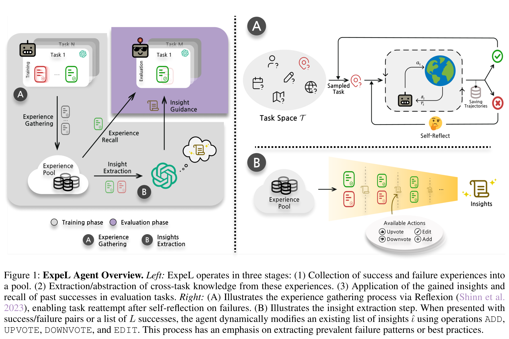

# ExpeL — 宏观主图与同名机制展开

**核验：Verified。** AAAI 2024；[官方发表记录](https://ojs.aaai.org/index.php/AAAI/article/view/29936)。保存的是[作者自存 PDF](https://yongjinliu.github.io/files/2024-ExpeL_LLM_Agents_Are_Experiential_Learners.pdf)，共38页，分析 **Figure 1，PDF第3页**。页码只适用于已保存版本。已读图注、§4、§4.1–4.3；渲染并查看原图和680px通栏预览。技术相关性4/5，视觉迁移价值5/5。

## A. Main visual thesis

第一眼是左侧从任务经验汇集、抽取、再进入紫色评估区的总体循环；右侧A/B进一步回答“这些经验如何形成、如何加工”。最突出的科学对象不是一排Agent模块，而是被收集、对比并转化为insights的经验。左侧斜向Experience Recall直接连接池与评估，另一条竖向Insight Guidance进入同一评估区，两类知识来源在空间上有明确区别。

## B. Global composition

左侧约占44%宽，右侧约56%，由点状竖线分隔。右侧再上下分为A采集、B提炼；于是是“一个主图+两个解释”，不是三个并列阶段。左图灰色的大L形底域包含训练阶段，右上紫色区域包含评估。A/B标记在左图与右图一一对应，读者无需追踪很长的跨区连线。整体的确存在分区，但它们有主从关系，区别于三个等权Dashboard卡片。

## C. Mechanism expansion

A将左图的经验收集展开为任务空间、环境交互、成功/失败、反思重试；B将抽取展开为多组成功/失败文档进入收窄的黄色带状区域，末端形成insights。B下方只列四个允许的编辑动作，不再为每个动作造一个模块。抽象主图与具体机制共享A/B索引和文档对象，这是最值得迁移的连接法。GitHarness可把历史图的选中边标为一个局部转换，再在下面展开该边，而非再复制一个独立历史库。

## D. Graph and state representation

红/绿文档图标表示失败/成功经验，叠置任务卡表示多任务集合；它们不是可恢复状态节点，也没有版本祖先关系。箭头表示经验的信息流和重试控制。B中沿收窄带排列的样本体现逐步归纳，但不能解释为历史分支压缩。对GitHarness只能借“相同对象跨尺度保持形态”，不能借经验池取代带Q/W配对的图拓扑。

## E. Training representation

左灰训练阶段面积明显大于紫色评估阶段，二者通过经验与insights相连。正文明确不更新模型参数，所谓training是采集经验与形成提示知识，图中没有梯度箭头。不能把这一灰/紫阶段划分直接说成Harness RL，也不能照搬其训练占比：GitHarness需要推理主线占主导，底部小型奖励回路返回唯一Git Agent。

## F. Visual density

密度主要来自对象复用、方向和A/B宏微映射，不来自长段落。成功失败颜色在主图、A和B反复使用，增强跨区联系。不过云、数据库圆柱、机器人、模型商标、阴影和表情图标较多，会形成装饰负担；GitHarness应去除这些元素，保留科学分层和对象连续性。原图也不是必须整体模仿的完美答案。

## G. Paper-scale readability

已实际检查[680px预览](../02_figures/expel_fig1_180mm96dpi.png)，相当于180mm@96dpi。主图/解释区比例、紫色评估区、两条进入评估的箭头仍清晰。A中的状态下标、B的四个操作和小Task标签已很小；“Available Actions”区与任务堆叠内部细字需要放大。该检查是屏幕代理，不是物理印刷认证。迁移时应保留这种宏观可读性，并比原图更严格减少细标签。

## H. Transfer to GitHarness

强迁移项是“唯一历史主图+有索引的局部边展开”：主图讲清v4被选中并产生v7，展开只解释为何v4兼容、W4怎样fork及局部更新。对象Q/W颜色和v4身份跨区保持，而不再画第二个独立图。弱迁移项是双知识输入，可用于区分动态反馈和历史需求上下文。不能迁移经验池、同任务重试成功覆盖失败的叙事，也不能把insight编辑四动作挪成Git Agent动作；它们的状态持久化与训练语义不同。与当前GitHarness图的实质区别应是取消下方“重新开一套模块流程”，使下方只是上方具体边的语义放大。

## 核验材料

- [完整页面](../02_figures/expel_pdfp3_full.png)、[源记录](../01_papers/expel_source.json)、[保存PDF](../01_papers/expel.pdf)。
- 原文图注明确将左侧定义为三阶段、右侧A/B定义为采集/抽取；§4.2明确经验召回和insight提炼是不同机制。这两点与图中双路输入、A/B结构吻合。
