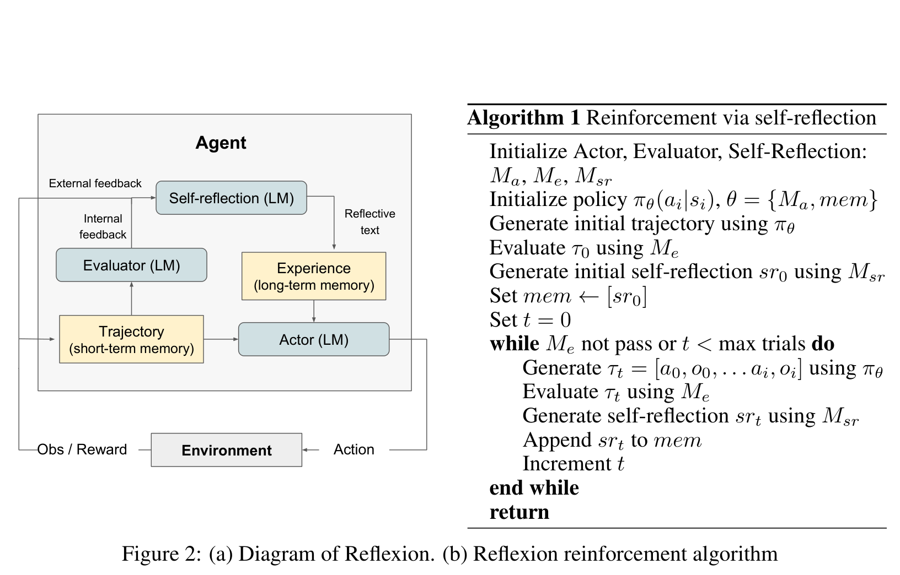

# Reflexion — 返回同一Actor的反馈闭环

**核验：Verified。** [NeurIPS 2023官方页面](https://proceedings.neurips.cc/paper_files/paper/2023/hash/1b44b878bb782e6954cd888628510e90-Abstract-Conference.html)；[官方PDF](https://papers.nips.cc/paper_files/paper/2023/file/1b44b878bb782e6954cd888628510e90-Paper-Conference.pdf)。分析 **Figure 2，PDF第4页**，同时阅读§3第3–4页。已查看原图与680px预览。技术相关性3/5，视觉迁移价值3/5；它是清晰闭环参照，也是一份不要整体照搬的工程框图对照。

## A. Main visual thesis

图左侧最明显的是一个Agent大域以及外部Environment；Agent内部的Trajectory与Experience各自进入Actor，反思产生的文本经Experience回到同一个Actor。科学主张由闭合路径表达：反馈不是停在评价器，而是形成下一次行为所用的记忆。右半幅是算法伪代码，占据与图解相近甚至略多的视觉面积。

## B. Global composition

整幅是左图解、右算法的双列组合。左侧一个浅灰Agent外框包住三个蓝灰LM模块及两个淡黄记忆块，Environment在框外下方。Action沿右侧向下，Obs/Reward沿左侧向上；因此外围大环是交互，内部短环是反思记忆。主线贯穿左半，右半通过语义和图注对应，没有跨列连线。对GitHarness而言，这种图解+算法平分空间会牺牲核心版本图，不适合作完整模板。

## C. Mechanism expansion

没有inset或放大镜结构；内部的短长期记忆和评价/反思只是同一闭环中的细分。外部反馈进入Self-reflection，内部Evaluator反馈也进入它，两种来源通过空间上的汇合表达。经验到Actor是单一明确向下箭头，避免再画第二个“训练后Actor”。这一点适合GitHarness训练反馈必须回到主图中唯一Git Agent的要求。

## D. Graph and state representation

框中是功能模块和记忆类型，并非带时间的状态实例。Trajectory为短期记忆，Experience为长期记忆；形状与颜色表明“数据对象”不同于LM组件。图无历史祖先边、无checkpoint版本对，也没有被选择历史base。其环状拓扑承担重试与记忆反馈的科学语义，不能将环中每个框理解成一版可恢复状态。

## E. Training representation

没有独立梯度训练区，也没有可训练/冻结组件标记。必须特别警惕标题中的reinforcement learning及伪代码里的policy notation：这里通过语言反思与记忆改善后续尝试，不是更新Actor权重。原文§3对记忆如何进入context有明确说明。借鉴的应是回路连接到同一个对象，不能直接把Experience→Actor标为policy gradient。GitHarness真实参数RL需用单独紫色虚线终止在Git Agent。

## F. Visual density

左半图密度来自不同尺度的两个回路和LM/Memory形状区分，文字相对短，没有长解释段。右半算法以文本和数学公式承载大量信息，使视觉中心部分转向代码式叙述。细灰箭头在小尺度下不够突出。GitHarness可保留外部交互与内部反馈的线型差异，但应让橙色选基线成为更强的单一视觉骨架，避免等权的模块网。

## G. Paper-scale readability

实际检查[680px预览](../02_figures/reflexion_fig2_180mm96dpi.png)：Agent、Actor、Environment及短长期记忆标签可辨，外围闭环仍明确；External/Internal feedback和细箭头已偏小。右半伪代码比左侧图标签更醒目，导致读者可能先读算法再看机制。180mm@96dpi只是屏幕模拟；该图的宏观结构稳，但并不能据此认定GitHarness也应加一整列伪代码。

## H. Transfer to GitHarness

值得迁移两点：区分“承载状态的对象”和“执行推理的角色”；让反馈真实终止于同一个政策节点。可把奖励计算放底边，用清楚的返回箭头上行到Git Agent，而不是指向Requirement Resolution大区边界。不可迁移黄色记忆框色码、Agent统一包围Router/Update Agent的做法，也不能用短长期记忆二分取代版本图。现有GitHarness最容易从此学到的是连线终点准确性，而不是造型成熟度；整体照搬反而会加重工程框图观感。

## 核验材料

- [完整页面](../02_figures/reflexion_pdfp4_full.png)、[源记录](../01_papers/reflexion_source.json)、[保存PDF](../01_papers/reflexion.pdf)。
- 图注明确(a)是Diagram、(b)是reinforcement algorithm；附近正文分别定义Actor、Evaluator、Self-reflection和Memory，支持以上角色与数据对象区分。
