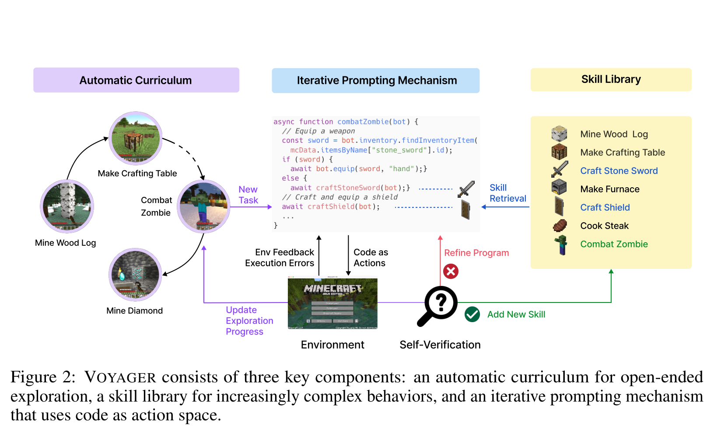

# Voyager — 中央工作对象贯通三域

**核验：Verified。** 发表身份是 **TMLR，March 2024**，不是ICLR2024；[作者实验室正式发表记录](https://rpl.cs.utexas.edu/publications/2024/03/14/wang-tmlr24-voyager/)已核实。图来自[arXiv原文](https://arxiv.org/pdf/2305.16291)，**Figure 2，PDF第2页**。已读图注、第2–3页引言和§2，并实际查看裁图和680px预览。技术相关性4/5，视觉迁移价值5/5。

## A. Main visual thesis

第一眼是左边不断产生任务、中间程序被执行和修正、右边技能可取用也可增长。中心不是“GPT-4模块”的大盒子，而是一段具体程序；程序里的蓝色函数与右侧同色技能标签形成对应。于是“已有能力被用于新任务，并形成新能力”通过一个共享工作对象可见，不完全依赖图注解释。

## B. Global composition

三列顶部仅用紫、蓝、淡黄标题带区分Automatic Curriculum、Iterative Prompting Mechanism、Skill Library，没有三个厚重外框。左列是弧形任务节点序列，中列代码及下方环境，右列是技能清单。读线并非机械左到右：左侧任务和右侧技能同时流入中间，底部验证将成功写回右侧、失败返修中间、探索进度返回左侧。三域由同一次程序执行贯通，避免三个模块孤岛。

## C. Mechanism expansion

主要放大发生在中央代码对象内部：两条蓝色虚线把程序调用引到剑/盾图标，右侧库中对应两项亦呈蓝色。借助相同名字、颜色和符号，读者能理解检索并非泛泛的memory→agent，而是已有技能进入当前程序。下方验证点把成功/失败后果分到不同方向。GitHarness可用W4与候选中的同名条目映射完成类似效果，而不必给每种操作单开卡片。

## D. Graph and state representation

左侧圆形Minecraft截图表现课程进展，箭头包括实线和一条虚线；这不是带恢复语义的版本图，不能把每个场景看作checkpoint。右侧是技能列表，蓝色突出被检索的技能，绿色突出新加入技能；它的空间安排承担“取已有、存新增”的语义，未表达祖先关系或完整需求状态。GitHarness可以迁移选择高亮和新增高亮，但必须继续保留v4→v7的真实父子边。

## E. Training representation

没有参数训练模块。正文明确通过黑箱GPT-4 prompting与in-context learning运行，不需要梯度训练或参数微调。底部Refine Program红线是失败后的程序修正；它不是训练梯度。对GitHarness不能将其直接转义为GRPO。Harness RL应成为外部、低权重的紫色反馈回路，而不是与候选更新混同。

## F. Visual density

高密度来自中央程序、库条目与调用之间的具象对应，以及同一验证节点分出的多路结果；不是很多说明句。标题带而非全域外框提供轻分组。缺点是程序细字不可缩得很小，Minecraft截图与多色图标较强烈，不能照搬到GitHarness。应借空间组织和对象对应，改用克制的Core Logic/Evaluation/Legacy API/Utilities条目。

## G. Paper-scale readability

实际检查[680px预览](../02_figures/voyager_fig2_180mm96dpi.png)：三列、双向流入中央、底部成功写回的大关系保持清晰；技能条目及New Task等可辨，但中央代码明显细小，只能依靠蓝色函数调用与图标识别大意。由于关键科学动作不依赖读完整代码，图仍有宏观有效性。GitHarness应做到所有必要语义都在短标签与拓扑层可见，不把要求兼容性藏在细代码里。

## H. Transfer to GitHarness

最强迁移是把“候选状态转换”放在中央，历史版本从一侧提供所选W4、需求/控制记录从另一侧提供约束，成功的新版本再接回同一历史图。另一可迁移点是轻标题带+无外框分区，能实质减少过度卡片化。边界也很明确：历史W4必须在隔离候选外，fork箭头进入候选；不能像技能库这样把历史对象仅表示为可组合函数；失败必须丢弃候选而不是画成继续修改同一历史。其成功写回空间形式可用，程序返修语义不可照搬。相较现有GitHarness，这一方向把工作对象变成视觉中心，Router等控制模块退居入口，不再平均分配画面。

## 核验材料

- [完整页面](../02_figures/voyager_pdfp2_full.png)、[源记录](../01_papers/voyager_source.json)、[保存PDF](../01_papers/voyager.pdf)。
- 第3页原文说明环境执行、错误/观测输入GPT-4、验证成功后存入skill library；这与图的上下反馈、成功写回路径相符。
