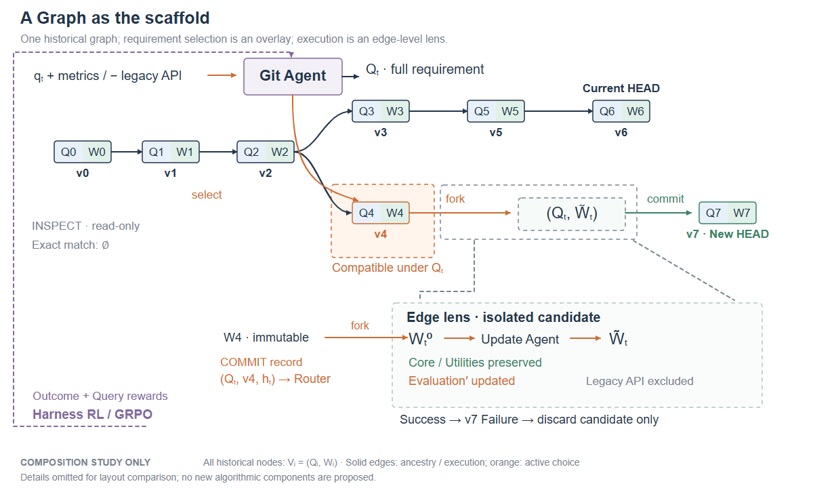
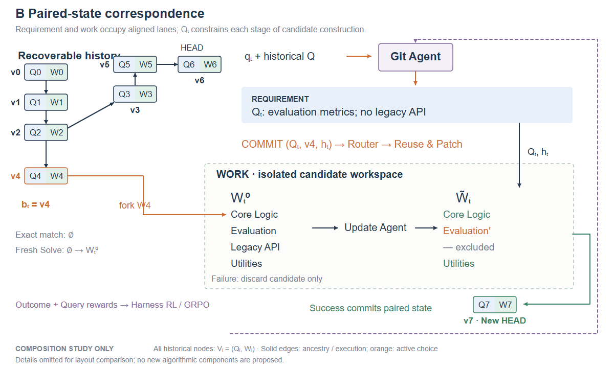
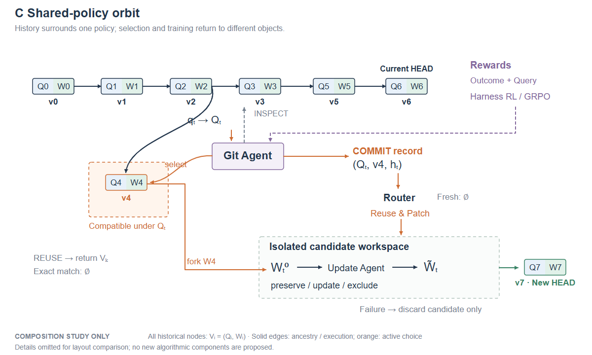
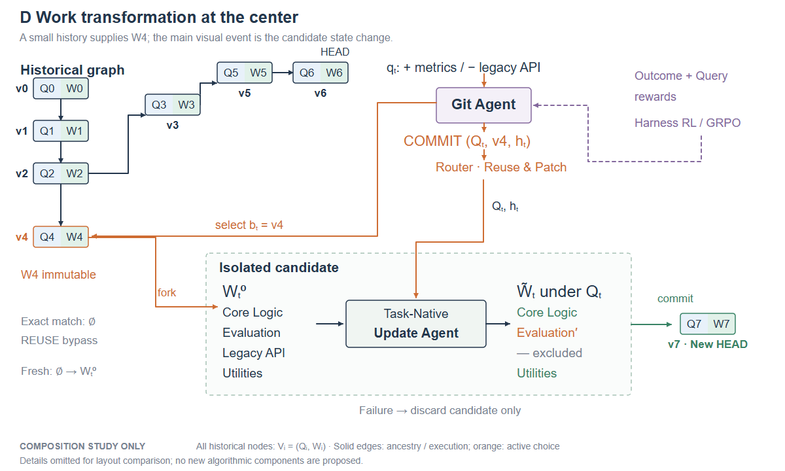

# GitHarness：四种原创构图研究方向

这些是**构图研究，不是最终 Figure 2**。依据12篇原论文方法图提炼组织原则；未复制任何论文的完整图形、独特图标或整套视觉系统。SVG使用原创基础形状与短英文标签；同色对象的身份连续性比装饰风格更重要。

## 共同的技术约束

- 历史节点始终为 `V_i=(Q_i,W_i)`；祖先拓扑固定为v0→v1→v2，上支v3→v5→v6，下支v4。
- 主实例没有exact match，选择v4，以COMMIT+Reuse & Patch生成v7。v7的父版本是v4；v6完整保留。
- Git Agent解析Q_t并输出`(Q_t,b_t=v4,h_t)`；Router外置且仅在COMMIT后调用。
- W4必须在隔离候选区外。fork之后才是W_t^0；Update Agent/Domain Harness生成W̃_t。候选对应Q_t，不引入新Q̃。
- preserve Core Logic/Utilities，update Evaluation，exclude Legacy API；失败丢弃整个candidate不是另一种Legacy API排除。
- REUSE是返回已有版本的旁路，不进入Router。Fresh Solve的初态为空，不读W4。
- 只有Git Agent训练。最终图必须有Outcome Reward和Query-Tracking Reward（Requirement Fidelity、Base Optimality、Staleness Exclusion）汇入Harness RL/GRPO，回到唯一Git Agent；Router、Update Agent和Domain Harness冻结。

草图中“Outcome + Query rewards”只是上述奖励结构的空间占位，并未提出新奖励。为观察重心，草图省略了完整奖励子项、部分可选路径实线和Domain Harness标签；这些省略不表示更改方法。B/C/D以“v4→fork→candidate→commit→v7”表达新枝，下一轮需强化v7与历史主图的一致祖先语法。A的边级放大是同一过程的另一个尺度，不是重复执行。

## A. 版本图作为主体，执行作为选中边的放大

[可编辑SVG](04_composition_studies/A_graph_scaffold.svg)

**参考：** [ToT Fig.2 / p5](03_analysis/tree_of_thoughts.md)、[ExpeL Fig.1 / p3](03_analysis/expel.md)、[LATS Fig.2 / p5](03_analysis/lats.md)。

**空间组织：** 唯一历史图占上部与中央的大部分宽度；Git Agent是图上方的控制者。Q_t下的兼容性直接叠加在真实v4上，不再建立第二套“历史分类UI”。从v4到candidate的边画取景框，以两条无箭头细引线连接右下执行透视；W4留在透视边界之外。训练藏在外围的细小闭环中。

**信息层级：** 第一眼看v6仍在而v7从v4分出；第二眼看选中的图对象被放大；第三眼才读W_t^0和局部差分。候选构造是主图的一条边，不是与主图竞争的第二张架构图。

**可迁移机制：** ToT真实状态上的取景起点；ExpeL宏观对象与解释的索引对应；LATS活跃与未选路径共享节点语法。GitHarness可将v4/W4的强调色和节点形状在两个尺度保持一致，局部展开无需额外大标题卡。

**潜在误解：** 兼容性区域若像永久分区，会把v4误当成始终最佳；应写“under Q_t”。放大连线若带箭头，会被误读为实际数据流；应无箭头。selected节点的橙色不是失败/成功判断；v6不是错误节点。训练线不能穿过祖先边或指向历史图。

**与现有版本的实质区别：** 取消下方第二套完整Requirement Resolution pipeline；兼容性回到真实图上。执行仅附着在真实fork边，主图占据视觉主导。现有Codex版本虽少框，但下层仍像重新启动的一套系统；A改变了区域的从属关系。没有收到可辨识v5.2原件，不能声称逐项比过其像素布局。

**下一轮判断：** 首选。做5秒观察测试，若读者直接说出“从旧v4开新分支而非接HEAD”，A实现核心任务。最终可把W_t^0→W̃_t透视再放大约15%，保持图区主导。

## B. Q/W双层对应，突出需求与工作的不同演化

[可编辑SVG](04_composition_studies/B_paired_lanes.svg)

**参考：** [Agent Lightning Fig.2 / p6](03_analysis/agent_lightning.md)、[A-Mem Fig.2 / p4](03_analysis/amem.md)、[LATS Fig.2 / p5](03_analysis/lats.md)。借相同槽位的状态比较与对象母题，不借原论文修改旧memory的语义。

**空间组织：** 左侧是一棵较窄的历史图；右侧上轨道是Q_t，下轨道是隔离的W_t^0→W̃_t。Q_t作为横向约束持续覆盖工作转变，v7在终点把需求和工作重新配对。四个工作组成部分在变换前后严格对齐；颜色变化就是差分。

**信息层级：** 首先区分“当前反馈q_t”和“完整需求Q_t”，再看工作差分，最后追溯W4的历史来源。轨道是两类状态的对应关系，不是两个Agent或两个独立pipeline。

**可迁移机制：** 固定槽位和跨快照同位对齐，减少preserve/update/exclude的解释句。Q_t的保持不变和W的临时演化以垂直对齐来说明；v7显示(Q7,W7)，图注再声明Q7=Q_t、W7为成功候选工作。

**潜在误解：** 上轨道不能被理解成连续多个Q版本，也不能把W4画入候选区。历史缩小后v6/v4关系可能不够醒目。上方Q_t还应保留完整需求其余约束，示例短标签只展示本轮变化，不能暗示Q_t只有两项。

**与现有版本的实质区别：** 不再以Requirement Resolution/Execution两个面板分区，而以两类被建模状态组织全图；需求不是一个流程节点后就消失，而是贯穿执行的条件。训练从底部整条模块带压缩为边缘回线。

**下一轮判断：** 适合审稿人最常误解q_t/Q_t或配对版本时采用。风险是历史选择贡献被工作差分盖过，必须单独测试是否仍能辨认v7的父版本。

## C. 围绕唯一Git Agent的共享策略闭环

[可编辑SVG](04_composition_studies/C_shared_policy.svg)

**参考：** [ACE Fig.4 / p5](03_analysis/ace.md)、[AWM Fig.2 / p3](03_analysis/awm.md)、[Reflexion Fig.2 / p4](03_analysis/reflexion.md)、[LoongReflect Fig.2 / p4](03_analysis/loongreflect.md)。

**空间组织：** 历史图环绕中央唯一Git Agent的上/左侧，v4位于左下；COMMIT记录横向伸向右侧外置Router；候选在下方。奖励和GRPO在右上以短回路返回中心策略。历史选择回到v4，训练回到Git Agent，成功提交回到新版本，三个作用域用不同落点区分。

**信息层级：** 中央策略做需求条件下的选择，右下执行是被调度的过程，上方历史是被读取的对象，训练是外围小回路。共享策略身份最清楚。

**可迁移机制：** ACE长/短回路区分、AWM回到同一Memory的对象恒等性、Reflexion回到同一Actor的精确落点；LoongReflect的推理/训练语义分层。这里不是照搬它们的圆形Agent、云或上下文回写。

**潜在误解：** 中央Agent可能被误认为执行所有任务；必须让Router、Update Agent保持外部且冻结。环形组织不能暗示图节点按几何距离代表兼容程度。训练与成功提交都形成回路，若颜色/端点不清可能混淆写版本和更新参数。

**与现有版本的实质区别：** 放弃上中下三条横带，改成同一策略周围的多个非对称关系。当前训练在底部长链里显得像另一个系统；C将它缩成返回唯一策略的关系。

**下一轮判断：** 次选探索。策略身份与训练贡献突出，但路由交叉和工程中心化的风险较高。不能因为闭环形状“好看”就弱化版本分支主命题。

## D. 候选工作变换为视觉中心，历史与需求作为两路输入

[可编辑SVG](04_composition_studies/D_central_transformation.svg)

**参考：** [Voyager Fig.2 / p2](03_analysis/voyager.md)、[Agent Lightning Fig.2 / p6](03_analysis/agent_lightning.md)、[AgenticRag-R1 Fig.2 / p4](03_analysis/agenticrag_r1.md)、[DS-Agent Fig.3 / p4](03_analysis/ds_agent.md)。

**空间组织：** 左上为紧凑历史图，v4落在左侧输入口；上中为q_t→Git Agent→COMMIT记录；中央大区是W_t^0与W̃_t的成分差分；v7在右侧输出。两路分别携带“恢复工作状态”与“当前需求/更新提示”，汇合于候选区内的执行。训练小回路放在右上，不再占一整行。

**信息层级：** 第一眼看保留、更新、排除发生在候选；第二眼看这是W4的fork；第三眼看Git Agent为何选v4及如何训练。历史图仍只有一份，W4保持区外，fork跨边界是主横向动作。

**可迁移机制：** Voyager的任务与历史技能同时进入中央代码对象、执行验证后成功写回；Agent Lightning固定槽位；AgenticRag的状态前后对应；DS-Agent对选中案例身份的连续追踪。将这些原则转换为真实工作checkpoint，不移植技能库/栈的存储语义。

**潜在误解：** 图可能让人以为创新是patch而不是base selection。选择v4的橙色路径必须足够醒目，v6清楚标HEAD。v7作为右端输出不能失去父版本关系；最终可增一条细祖先弧或让v7回嵌同一历史平面。不能把failed candidate指回W4画成rollback覆盖历史。

**与现有版本的实质区别：** 将原图较拥挤的右侧执行细节变成主视觉对象；Git Agent/Router等模块退为对这个对象施加操作的标签。中央不是大Update Agent盒子，而是两列同位工作成分。草图中的小Agent盒子只占变换区一小部分。

**下一轮判断：** 与A一起优先做对比。A最适合强调“choose a historical base”；D最适合强调“recoverable work, not flat context”。可探索A主图+D局部透视的组合，但不能把两张完整图直接叠加。

## 推荐推进顺序与验收

1. **A与D各做一个中等保真版本**，同样文字预算、同样节点尺寸和颜色，不以美术差异干扰构图判断。
2. 给不熟悉方法的人看5秒，问“为什么不从v6开始”“W4有没有被改”“哪一个模块被训练”。只记录回答，不给提示。
3. 20秒阅读后检查q_t/Q_t、REUSE旁路、Fresh Solve、失败候选的作用域。关键误读任一出现，就回到拓扑与边界修改，先不调配色。
4. B用于解决配对状态误读，C用于解决训练策略身份误读；若A或D已经解决这两点，无需把四种机制全部合并。

目标尺寸：最终按论文实际`\textwidth`检查，不预设ICLR、NeurIPS、ICML通栏宽度完全一致。180mm/680px仅为本次跨图对比的统一代理；下一轮建议同时测140mm与180mm。次级标签力争不低于最终6.5–7pt，主对象更大。
